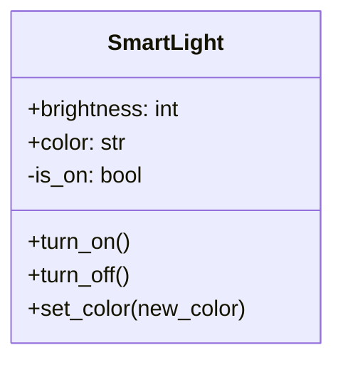
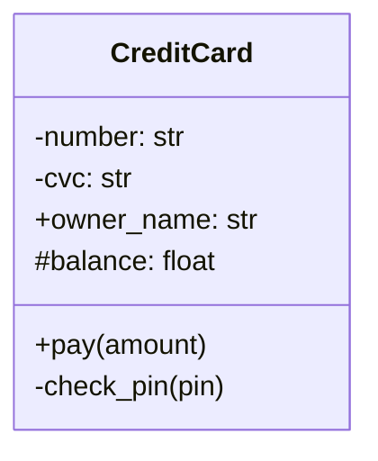
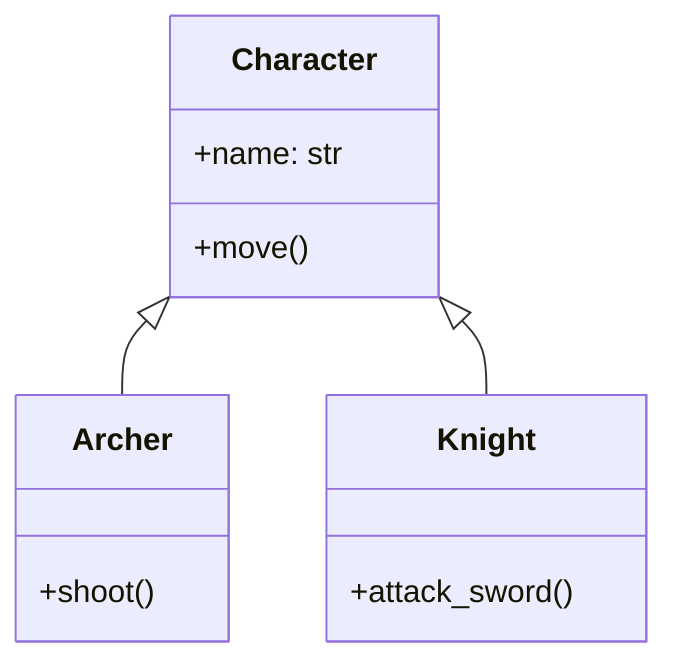
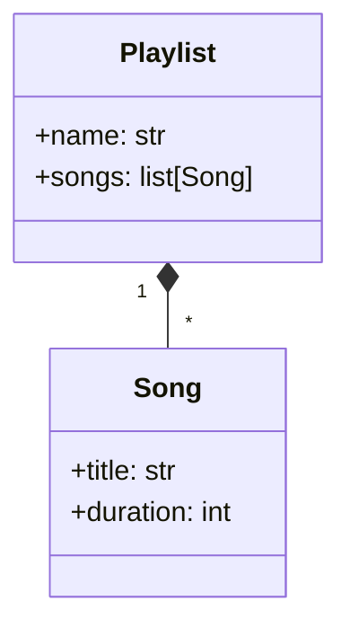
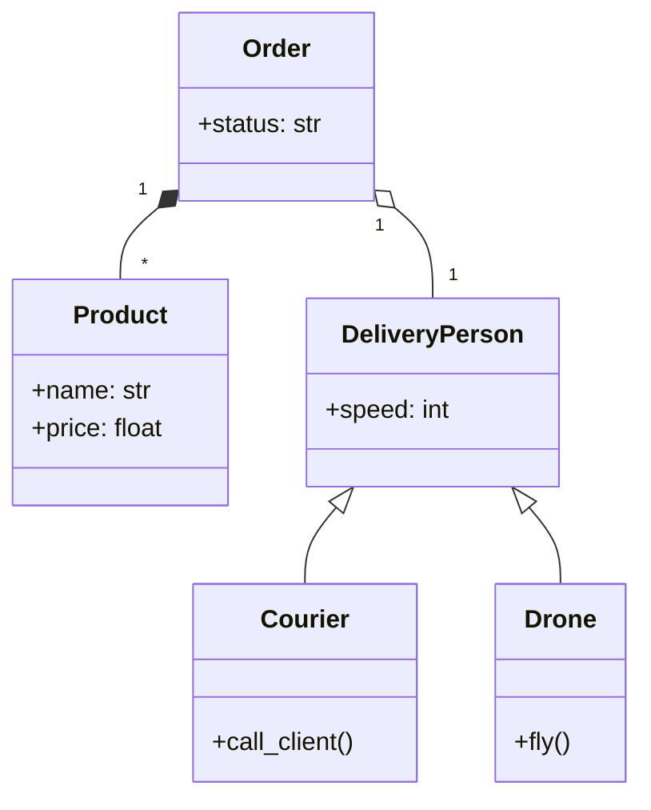
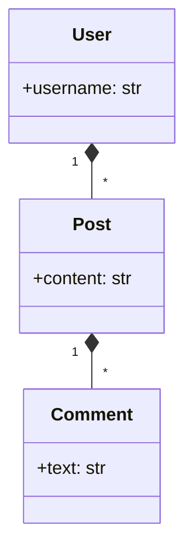

## Проектирование классов и основы ООП

**Цель работы:** Научиться анализировать предметную область, выделять сущности (классы) и устанавливать между ними правильные связи (наследование, композиция, агрегация) с помощью инструмента **Mermaid**.

**Задачи работы:**
1. Изучить теоретический материал по проектированию.
2. Проанализировать текстовые описания задач.
3. Составить диаграммы классов (Class Diagrams) для каждой задачи.
### Практическая часть

#### Задание 1. Базовая структура (Умный дом)
Спроектируйте класс `SmartLight` (Умная лампочка).

Прибор должен иметь следующие характеристики:
**Атрибуты:**
*   `brightness` (яркость, целое число) — доступно всем.
*   `color` (цвет, строка) — доступно всем.
*   `is_on` (включена ли, булево) — скрытое (приватное) свойство, чтобы нельзя было включить "в обход" выключателя.

**Методы:**
*   `turn_on()` — включить.
*   `turn_off()` — выключить.
*   `set_color(new_color)` — изменить цвет.

#### Задание 2. Инкапсуляция и Безопасность (Банковская карта)
Спроектируйте класс `CreditCard`.

Банковская сфера требует защиты данных, поэтому:
*   Номер карты (`number`) и CVC-код (`cvc`) должны быть **приватными** (`-`).
*   Имя владельца (`owner_name`) может быть **публичным** (`+`).
*   Баланс (`balance`) должен быть **защищенным** (`#`) (доступен классу и его наследникам, но не всем подряд).

Добавьте методы:
*   `pay(amount)` — публичный метод оплаты.
*   `check_pin(pin)` — приватный метод проверки пин-кода (вызывается внутри метода оплаты).

#### Задание 3. Наследование (Иерархия RPG)
В компьютерной игре есть разные типы персонажей:
1.  Есть базовый класс `Character` (Персонаж). У него есть имя (`name`) и метод `move()` (идти).
2.  Есть `Archer` (Лучник). Он является персонажем. У него есть дополнительный метод `shoot()` (стрелять).
3.  Есть `Knight` (Рыцарь). Он является персонажем. У него есть дополнительный метод `attack_sword()` (бить мечом).

#### Задание 4. Типы связей (Музыкальный плеер)
Спроектируйте систему из двух классов: `Playlist` (Плейлист) и `Song` (Песня):
*   Класс `Song` имеет название (`title`) и длительность (`duration`).
*   Класс `Playlist` имеет название (`name`) и список песен.

#### Задание 5. Комплексная система (Служба доставки)
Проанализируйте текст и спроектируйте полную схему классов.

> В системе есть **Заказ**. Каждый заказ обязательно состоит из нескольких **Товаров**. Товар не может существовать в контексте заказа без самого заказа, но у товара есть название и цена.
> У заказа есть статус.
> 
> Существуют разные виды доставки: **Курьер** и **Дрон**. И Курьер, и Дрон являются **Доставщиками**. У любого Доставщика есть скорость, но только Дрон умеет летать, а Курьер умеет звонить клиенту.
> 
> Заказ закрепляется за одним конкретным Доставщиком

**Алгоритм действий:**
1.  Выделите 5 классов.
2.  Определите, где Наследование (`<|--`).
3.  Определите, где Композиция (`*--`).
4.  Определите, где Агрегация (`o--`).

#### Задание 6
Придумайте и спроектируйте структуру классов для **Социальной сети**.
В системе должны быть:
*   Пользователь.
*   Пост (сообщение).
*   Комментарий.

**Условия связей:**
1.  Один Пользователь может написать много Постов.
2.  Пост жестко привязан к Пользователю (или нет? Решите сами и обоснуйте выбором стрелки).
3.  К Посту можно оставлять Комментарии. Если удалить Пост, комментарии тоже должны исчезнуть.

**Требование:** Нарисовать схему и добавить короткий комментарий почему вы выбрали именно такие связи.
